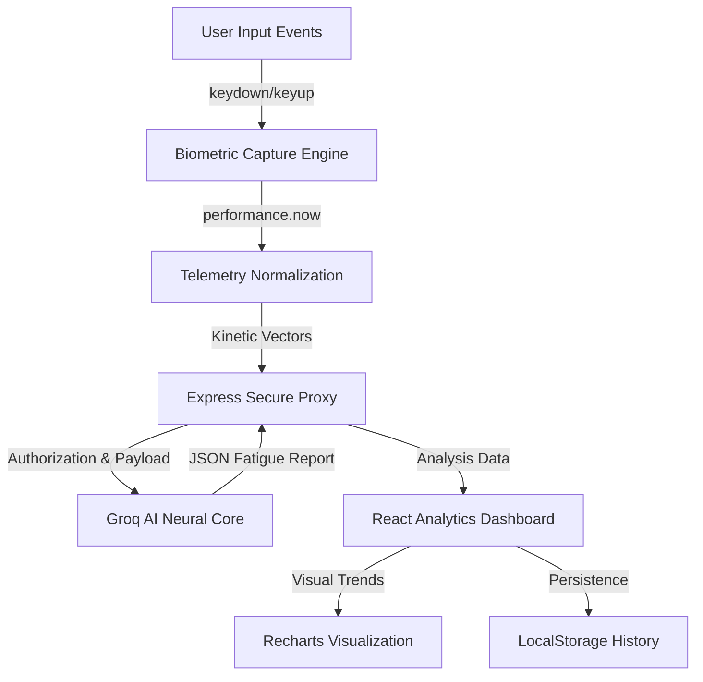

# Kinetic Scan: Neuro-Kinetic Fatigue Monitor

## 🧠 Introduction
Kinetic Scan is a sophisticated neuro-ergonomic assessment platform designed to identify **Acute Cognitive Fatigue** through high-resolution biometric telemetry. By utilizing **Keystroke Dynamics**, the system detects subtle "Rhythmic Decomposition"—micro-variations in typing intervals that precede measurable performance decline. This tool serves as a non-invasive diagnostic layer for high-stakes environments where cognitive readiness is paramount.

## 🛠️ System Design
Below is the architectural flow of the Kinetic Scan platform, illustrating the process from raw telemetry acquisition to neural inference and visualization.

## 📦 Technology Stack

### Frontend (Client-Side)
- **Engine**: React 19 (Functional Components & Hooks)
- **Styling**: Tailwind CSS 4 (Utility-first architecture)
- **Animations**: Motion (Layout transitions and rhythmic feedback)
- **Data Visualization**: Recharts (Longitudinal trend analysis)
- **Icons**: Lucide React

### Backend (Server-Side)
- **Runtime**: Node.js with Express
- **Language**: TypeScript
- **Security**: Server-side credential isolation (Secure Proxy Pattern)
- **AI Core**: Groq SDK (Llama 3-8b-8192) for near-instantaneous neural inference

## 🤝 Project Details
- **Project Name**: Kinetic Scan
- **Institution/Team**: ANB Squad
- **Lead Developer**: Asma Khalid
- **Status**: Production-Ready / Neuro-Ergonomic Assessment Tool
- **Security Compliance**: Zero-trust API architecture; sensitive keys are never exposed to the client-side.

---
*Developed by ANB Squad - Advancing Neuro-Biometric Assessment.*
